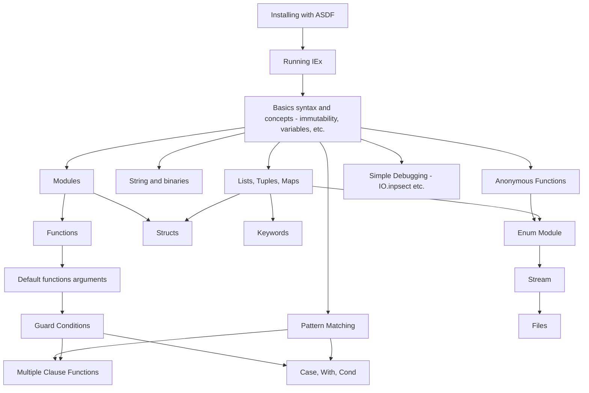
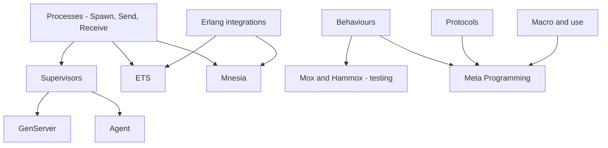

Simple diagrams and resources to help learning Elixir, Phoenix, Ecto and other useful stuff for Web Developers.

- [🗨️ Intro](#️-intro)
    - [❔ What to expect](#-what-to-expect)
    - [Contributions](#contributions)
- [📖 Global Resources](#-global-resources)
  - [🔬 What is Elixir ?](#-what-is-elixir-)
    - [What is functional programming?](#what-is-functional-programming)
    - [Global learning and “veille” resources](#global-learning-and-veille-resources)
    - [Why going for Elixir ?](#why-going-for-elixir-)
- [Level 1 (Elixir)](#level-1-elixir)
    - [Installing Elixir and Running IEx](#installing-elixir-and-running-iex)
    - [Elixir guide styles (non exhaustive)](#elixir-guide-styles-non-exhaustive)
    - [Basics (Getting started with Elixir)](#basics-getting-started-with-elixir)
    - [String and binaries](#string-and-binaries)
    - [Collections (List, tuples, map, etc.)](#collections-list-tuples-map-etc)
    - [Pattern matching](#pattern-matching)
    - [Modules and functions](#modules-and-functions)
    - [Structs](#structs)
    - [Guard conditions](#guard-conditions)
    - [Controls Structures (cond, with, case, if)](#controls-structures-cond-with-case-if)
    - [IO and files](#io-and-files)
    - [Debugging with Elixir](#debugging-with-elixir)
- [Level II (Phoenix, Ecto and OTP basics)](#level-ii-phoenix-ecto-and-otp-basics)
    - [Mix](#mix)
    - [Errors and Exceptions](#errors-and-exceptions)
    - [Testing your code](#testing-your-code)
    - [Configuration and releases](#configuration-and-releases)
- [Level III (OTP, MetaProgramming)](#level-iii-otp-metaprogramming)

# 🗨️ Intro

### ❔ What to expect

This document can help guiding you through Elixir and give you directions what to learn next.
This is not the only way to learn Elixir and should not be considered like a course. The goal here is just to give some tips and resources for each concepts we believe are important.
Each levels represent knowledge that are usefull for Elixir Developers, but Espacially for Web Developer. A lot might be missing, feel free to contributes with your own resources, path, etc.

### Contributions

Anyone can contributes, add resources, links and update mermaid diagrams :) Feel free to open a PR with your updates!

# 📖 Global Resources

## 🔬 What is Elixir ?

- [https://www.youtube.com/watch?v=dPRt5pOIFHk](https://www.youtube.com/watch?v=dPRt5pOIFHk) (Jose Valim, creator of Elixir)
- [https://elixir-lang.org/](https://elixir-lang.org/)
- [https://serokell.io/blog/introduction-to-elixir](https://serokell.io/blog/introduction-to-elixir)

### What is functional programming?

- [https://github.com/readme/guides/functional-programming-basics](https://github.com/readme/guides/functional-programming-basics)

### Global learning and “veille” resources

- [https://elixir-lang.org/docs.html](https://elixir-lang.org/docs.html)
- [https://elixirschool.com/en](https://elixirschool.com/en)
- [https://exercism.org/tracks/elixir/concepts](https://exercism.org/tracks/elixir/concepts)
- [https://thinkingelixir.com/](https://thinkingelixir.com/)
- [https://github.com/h4cc/awesome-elixir](https://github.com/h4cc/awesome-elixir)
- [https://www.youtube.com/c/ElixirConf](https://www.youtube.com/c/ElixirConf)
- [https://blog.appsignal.com/](https://blog.appsignal.com/)

### Why going for Elixir ?

- ****[The Soul of Erlang and Elixir • Saša Jurić • GOTO 2019](https://www.youtube.com/watch?v=JvBT4XBdoUE)**** (42min)

# Level 1 (Elixir)

→ During this level you can practice using the [Exercism’s Elixir track](https://exercism.org/tracks/elixir). They have puzzles and exercises for every Elixir concepts. And their [Sylabus](https://exercism.org/tracks/elixir/concepts) is great!

→ You can also refer to [ElixirSchool](https://elixirschool.com/en) and the [official Elixir documentation](https://elixir-lang.org/getting-started/introduction.html).

### Installing Elixir and Running IEx

- **asdf (version manager)**:
    - [asdf](https://asdf-vm.com/)
    - [Installing Elixir and Erlang With ASDF](https://www.pluralsight.com/guides/installing-elixir-erlang-with-asdf)
    
- **IEx (elixir console) and compilation**:
    - [https://elixir-lang.org/getting-started/introduction.html#interactive-mode](https://elixir-lang.org/getting-started/introduction.html#interactive-mode)
    - [https://elixirschool.com/en/lessons/basics/iex_helpers](https://elixirschool.com/en/lessons/basics/iex_helpers)
    - [https://medium.com/@fxn/how-does-elixir-compile-execute-code-c1b36c9ec8cf](https://medium.com/@fxn/how-does-elixir-compile-execute-code-c1b36c9ec8cf)

### Elixir guide styles (non exhaustive)

- [https://hexdocs.pm/elixir/1.13.4/naming-conventions.html#content](https://hexdocs.pm/elixir/1.13.4/naming-conventions.html#content)
- https://github.com/christopheradams/elixir_style_guide
- [https://blog.lelonek.me/an-opinionated-elixir-style-guide-2-67899790563f](https://blog.lelonek.me/an-opinionated-elixir-style-guide-2-67899790563f)

### Basics (Getting started with Elixir)

- **Basic types and operators:**
    - [https://elixir-lang.org/getting-started/basic-types.html](https://elixir-lang.org/getting-started/basic-types.html)
    - [https://elixir-lang.org/getting-started/basic-operators.html](https://elixir-lang.org/getting-started/basic-operators.html)
    - [https://elixirschool.com/en/lessons/basics/basics#basic-data-types-3](https://elixirschool.com/en/lessons/basics/basics#basic-data-types-3)
- **Imutability**:
    - [https://darioghilardi.com/immutability-in-elixir/](https://darioghilardi.com/immutability-in-elixir/)

### String and binaries

- [https://elixir-lang.org/getting-started/binaries-strings-and-char-lists.html](https://elixir-lang.org/getting-started/binaries-strings-and-char-lists.html)

### Collections (List, tuples, map, etc.)

- **List, tuples, map, keywords:**
    - [https://elixirschool.com/en/lessons/basics/collections](https://elixirschool.com/en/lessons/basics/collections)
- **List comprehension:**
    - [https://elixir-lang.org/getting-started/comprehensions.html](https://elixir-lang.org/getting-started/comprehensions.html)
- **Enum modules:**
    - [https://elixirschool.com/en/lessons/basics/enum](https://elixirschool.com/en/lessons/basics/enum)
    - [https://elixir-lang.org/getting-started/enumerables-and-streams.html](https://elixir-lang.org/getting-started/enumerables-and-streams.html)

### Pattern matching

- [https://elixir-lang.org/getting-started/pattern-matching.html](https://elixir-lang.org/getting-started/pattern-matching.html)
- [https://elixirschool.com/fr/lessons/basics/pattern_matching](https://elixirschool.com/fr/lessons/basics/pattern_matching)

### Modules and functions

- [https://elixir-lang.org/getting-started/modules-and-functions.html](https://elixir-lang.org/getting-started/modules-and-functions.html)
- [https://elixirschool.com/en/lessons/basics/modules#composition-3](https://elixirschool.com/en/lessons/basics/modules#composition-3)
- **functions (and anonymous functions)**:
    - [https://elixirschool.com/en/lessons/basics/functions](https://elixirschool.com/en/lessons/basics/functions)
    - **Default function argument:**
        - [https://elixirschool.com/en/lessons/basics/functions#default-arguments-7](https://elixirschool.com/en/lessons/basics/functions#default-arguments-7)
        - [https://elixir-lang.org/getting-started/modules-and-functions.html#default-arguments](https://elixir-lang.org/getting-started/modules-and-functions.html#default-arguments)
    - **Functions and pattern matching:**
        - [https://elixirschool.com/en/lessons/basics/functions#functions-and-pattern-matching-4](https://elixirschool.com/en/lessons/basics/functions#functions-and-pattern-matching-4)

### Structs

- [https://elixir-lang.org/getting-started/structs.html](https://elixir-lang.org/getting-started/structs.html)

### Guard conditions

- [https://hexdocs.pm/elixir/1.13.4/patterns-and-guards.html#guards](https://hexdocs.pm/elixir/1.13.4/patterns-and-guards.html#guards)

### Controls Structures (cond, with, case, if)

- [https://elixir-lang.org/getting-started/case-cond-and-if.html](https://elixir-lang.org/getting-started/case-cond-and-if.html)
- [https://elixirschool.com/en/lessons/basics/control_structures](https://elixirschool.com/en/lessons/basics/control_structures)

### IO and files

- [https://elixir-lang.org/getting-started/io-and-the-file-system.html](https://elixir-lang.org/getting-started/io-and-the-file-system.html)

### Debugging with Elixir

- [https://blog.appsignal.com/2021/11/30/three-ways-to-debug-code-in-elixir.html](https://blog.appsignal.com/2021/11/30/three-ways-to-debug-code-in-elixir.html)

# Level II (Phoenix, Ecto and OTP basics)

### Mix

- [https://elixirschool.com/en/lessons/basics/mix](https://elixirschool.com/en/lessons/basics/mix)
- [https://elixir-lang.org/getting-started/mix-otp/introduction-to-mix.html](https://elixir-lang.org/getting-started/mix-otp/introduction-to-mix.html)

### Errors and Exceptions

- [https://elixir-lang.org/getting-started/try-catch-and-rescue.html](https://elixir-lang.org/getting-started/try-catch-and-rescue.html)
- [https://elixirschool.com/en/lessons/intermediate/error_handling](https://elixirschool.com/en/lessons/intermediate/error_handling)

### Testing your code

- [https://hexdocs.pm/ex_unit/1.13/ExUnit.html](https://hexdocs.pm/ex_unit/1.13/ExUnit.html)
- [https://semaphoreci.com/community/tutorials/introduction-to-testing-elixir-applications-with-exunit](https://semaphoreci.com/community/tutorials/introduction-to-testing-elixir-applications-with-exunit)
- [https://elixirschool.com/en/lessons/testing/basics](https://elixirschool.com/en/lessons/testing/basics)

### Configuration and releases

- [https://elixir-lang.org/getting-started/mix-otp/config-and-releases.html](https://elixir-lang.org/getting-started/mix-otp/config-and-releases.html)

# Level III (OTP, MetaProgramming)

