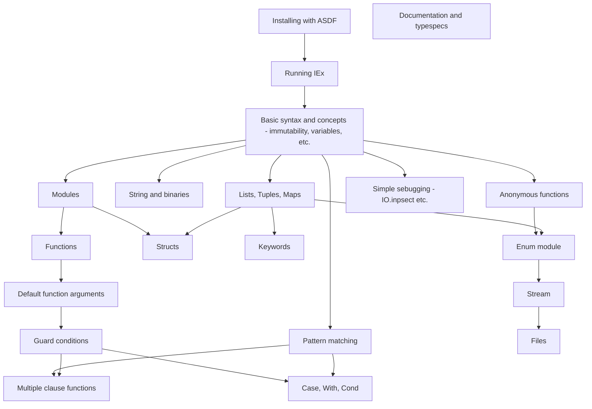
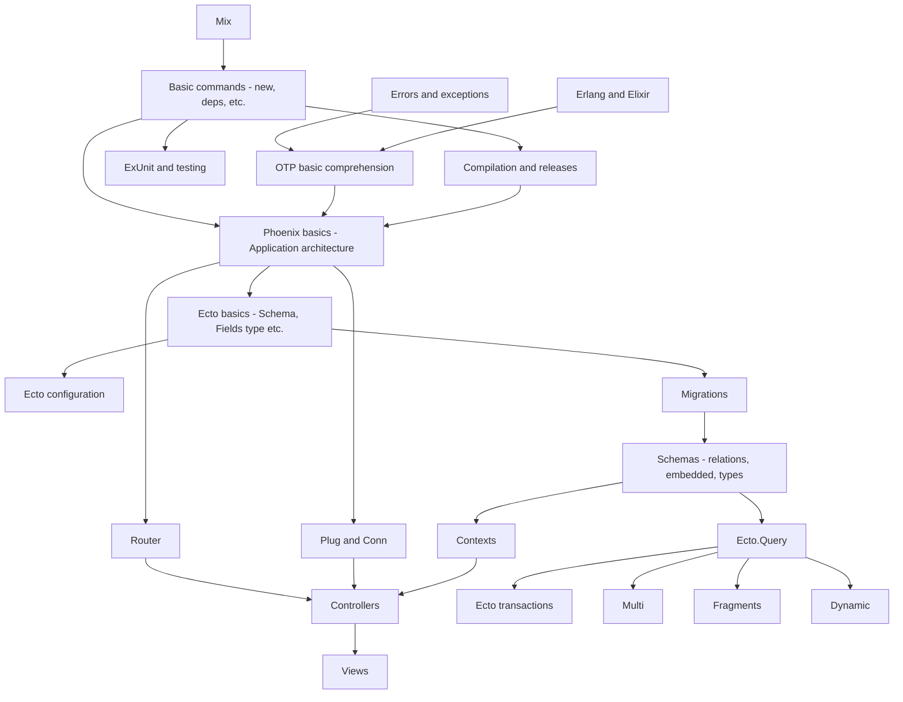
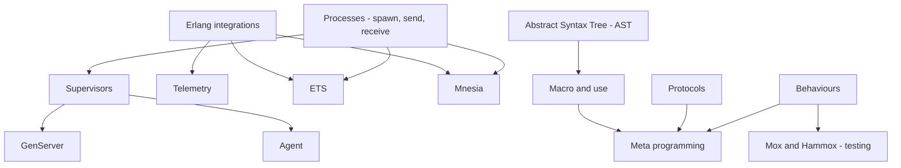

Simple diagrams and resources to help learning Elixir, Phoenix, Ecto and other useful stuff for Web Developers.

- [🗨️ Intro](#️-intro)
  - [❔ What to expect](#-what-to-expect)
  - [Contributions](#contributions)
- [📖 Global Resources](#-global-resources)
  - [🔬 What is Elixir ?](#-what-is-elixir-)
    - [What is functional programming?](#what-is-functional-programming)
    - [Global learning and tech watch resources](#global-learning-and-tech-watch-resources)
    - [Why go for Elixir ?](#why-go-for-elixir-)
    - [10 tips for new elixir developpers](#10-tips-for-new-elixir-developpers)
    - [Elixir cheat sheet](#elixir-cheat-sheet)
- [Elixir learning path](#elixir-learning-path)
  - [Level 1 (Elixir)](#level-1-elixir)
    - [Installing Elixir and Running IEx](#installing-elixir-and-running-iex)
    - [Elixir guide styles (non exhaustive)](#elixir-guide-styles-non-exhaustive)
    - [Basics (Getting started with Elixir)](#basics-getting-started-with-elixir)
    - [String and binaries](#string-and-binaries)
    - [Collections (List, tuples, map, etc.)](#collections-list-tuples-map-etc)
    - [Pattern matching](#pattern-matching)
    - [Modules and functions](#modules-and-functions)
    - [Structs](#structs)
    - [Guard conditions](#guard-conditions)
    - [Controls Structures (cond, with, case, if)](#controls-structures-cond-with-case-if)
    - [IO and files](#io-and-files)
    - [Debugging with Elixir](#debugging-with-elixir)
  - [Level 2 (Phoenix, Ecto and OTP basics)](#level-2-phoenix-ecto-and-otp-basics)
    - [Mix](#mix)
    - [Errors and Exceptions](#errors-and-exceptions)
    - [Testing your code](#testing-your-code)
    - [Configuration and releases](#configuration-and-releases)
    - [Erlang with Elixir](#erlang-with-elixir)
    - [OTP Basics](#otp-basics)
    - [Phoenix](#phoenix)
    - [Ecto](#ecto)
  - [Level 3 (OTP, MetaProgramming, security)](#level-3-otp-metaprogramming)
    - [Processes (Spawn, Links, Tasks, etc.)](#processes-spawn-links-tasks-etc)
    - [Supervisors](#supervisors)
    - [AST](#ast)
    - [Advanced testing](#advanced-testing)
    - [Security](#security)
- [📚 Other resources](#-other-resources)
- [🏘️ Communities](#️-communities)

# 🗨️ Intro

### ❔ What to expect

This document can help guide you through Elixir and give you some ideas about what to learn next.
This learning path shows one of the many ways to learn Elixir, and should not be considered as a course. The goal here is to give you some tips and resources for each concepts we believe are important.

Each level represents knowledge that are usefull for Elixir Developers, espacially for Web Developers. Some concepts might be missing, so feel free to contribute with your own resources, path, etc.
The diagrams provided in this document are meant to illustrate concepts of each leavel, and resources you can find here will match multiple steps of a diagram. That's why resources don't always match the diagrams.
Some of the concepts are arbitrarly put in a higher level because of their complexity, however, they might not really belong to that level. For example, AST is the core to Elixir and might be important to be mentioned earlier, but due to its complexity, I put it in level 3.

### Contributions

Anyone can contribute, add resources, links and update mermaid diagrams :) Feel free to open a PR with your updates!

# 📖 Global Resources

## 🔬 What is Elixir ?

- [BEHIND THE CODE: The one who created Elixir](https://www.youtube.com/watch?v=dPRt5pOIFHk) (Jose Valim, creator of Elixir)
- [Elixir official website](https://elixir-lang.org/)
- [Introduction to Elixir by Gints Dreimanis](https://serokell.io/blog/introduction-to-elixir)
- [Elixir in 100 seconds](https://www.youtube.com/watch?v=R7t7zca8SyM)
- [Elixir: The Documentary](https://www.youtube.com/watch?v=lxYFOM3UJzo)

### What is functional programming?

- [Functional Programming 101 by Cassidy Williams](https://github.com/readme/guides/functional-programming-basics)
- [What is functional programming | Easy way](https://www.youtube.com/watch?v=dAPL7MQGjyM)

### Global learning and tech watch resources

- [Official Elixir documentation](https://elixir-lang.org/docs.html)
- [ElixirSchool](https://elixirschool.com/en)
- [Exercism's Elixir track](https://exercism.org/tracks/elixir/concepts)
- [ThinkingElixir podcast](https://thinkingelixir.com/)
- [Awesome Elixir](https://github.com/h4cc/awesome-elixir)
- [ElixirConf youtube channel](https://www.youtube.com/c/ElixirConf)
- [Welcome to The Jungle Tech medium page](https://medium.com/wttj-tech)
- [AppSignal's blog](https://blog.appsignal.com/)
- [Programming Elixir 1.6](https://pragprog.com/titles/elixir16/programming-elixir-1-6/) by Dave Thomas
- [Elixir in Action](https://www.manning.com/books/elixir-in-action-second-edition) by Saša Jurić
- [Alchemist Camp](https://alchemist.camp/)
- [Joy of Elixir](https://joyofelixir.com/toc.html)
- [Elixir Newbie](https://www.elixirnewbie.com/blog)
- [CodeCast’s Intro to Elixir](https://www.codecast.io/courses/58-intro-to-elixir)
- [An Animated Introduction to Elixir](https://markm208.github.io/exbook/)
- [ElixirWeekly](https://elixirweekly.net/)
- [ElixirStatus](https://elixirstatus.com/)

### Why go for Elixir ?

- [The Soul of Erlang and Elixir • Saša Jurić • GOTO 2019](https://www.youtube.com/watch?v=JvBT4XBdoUE) (42min)

### 10 tips for new elixir developpers

- [10 tips](https://dev.to/chriis/10-tips-for-new-elixir-developers-48jl)

### Elixir cheat sheet

- [Elixir cheat sheet](https://media.pragprog.com/titles/elixir/ElixirCheat.pdf)

# Elixir learning path

## Level 1 (Elixir)

→ At this level, you can practice coding with Elixir using the [Exercism’s Elixir track](https://exercism.org/tracks/elixir), a website where you can find puzzles and exercises for every Elixir concepts.
Plus, their [Sylabus](https://exercism.org/tracks/elixir/concepts) is great!

→ You can also refer to [ElixirSchool](https://elixirschool.com/en) and the [official Elixir documentation](https://elixir-lang.org/getting-started/introduction.html).

→ [An Animated Introduction to Elixir](https://markm208.github.io/exbook/) is also a good entry point to practice Elixir's concepts.

### Installing Elixir and Running IEx

- **asdf (version manager)**:
  - [Asdf](https://asdf-vm.com/)
  - [Installing Elixir and Erlang With ASDF](https://www.pluralsight.com/guides/installing-elixir-erlang-with-asdf)
- **IEx (elixir console) and compilation**:
  - [Elixir Interactive mode](https://elixir-lang.org/getting-started/introduction.html#interactive-mode)
  - ["IEx Helpers" by Elixir School](https://elixirschool.com/en/lessons/basics/iex_helpers)
  - [How does Elixir compile/execute code? by Xavier Noria](https://medium.com/@fxn/how-does-elixir-compile-execute-code-c1b36c9ec8cf)

### Elixir guide styles (non exhaustive)

- [Naming Conventions](https://hexdocs.pm/elixir/1.13.4/naming-conventions.html#content)
- [The Elixir Style Guide](https://github.com/christopheradams/elixir_style_guide) (github)

### Basics (Getting started with Elixir)

- **Basic types and operators:**
  - [Basic types](https://elixir-lang.org/getting-started/basic-types.html)
  - [Basic operators](https://hexdocs.pm/elixir/1.17.2/operators.html)
  - ["Basic Data Types" from Elixir School](https://elixirschool.com/en/lessons/basics/basics#basic-data-types-3)
- **Imutability**:
  - [Understanding Elixir’s Immutability and Data Structures](https://clouddevs.com/elixir/immutability-and-data-structures/) by lago

### String and binaries

- [Elixir's Binaries, strings, and charlists](https://elixir-lang.org/getting-started/binaries-strings-and-char-lists.html)

### Collections (List, tuples, map, etc.)

- **List, tuples, map, keywords:**
  - ["Collections" by Elixir School](https://elixirschool.com/en/lessons/basics/collections)
- **List comprehension:**
  - [Elixir's List Comprehensions](https://elixir-lang.org/getting-started/comprehensions.html)
- **Enum modules:**
  - ["Enum" by Elixir School](https://elixirschool.com/en/lessons/basics/enum)
  - [Elixir's Enumerables and Streams](https://elixir-lang.org/getting-started/enumerables-and-streams.html)

### Pattern matching

- [Elixir's Pattern matching](https://elixir-lang.org/getting-started/pattern-matching.html)
- ["Pattern Matching" by Elixir School](https://elixirschool.com/fr/lessons/basics/pattern_matching)

### Modules and functions

- [Elixir's Modules and functions](https://elixir-lang.org/getting-started/modules-and-functions.html)
- ["Composition" by Elixir School](https://elixirschool.com/en/lessons/basics/modules#composition-3)
- **functions (and anonymous functions)**:

  - ["Functions" by Elixir School](https://elixirschool.com/en/lessons/basics/functions)
  - **Default function argument:**

    - [Elixir's Default arguments](https://elixir-lang.org/getting-started/modules-and-functions.html#default-arguments)
    - ["Default Arguments" by Elixir School](https://elixirschool.com/en/lessons/basics/functions#default-arguments-7)

  - **Functions and pattern matching:**
    - ["Functions and Pattern Matching" by Elixir School](https://elixirschool.com/en/lessons/basics/functions#functions-and-pattern-matching-4)

### Structs

- [Structs](https://elixir-lang.org/getting-started/structs.html)

### Guard conditions

- [Guards on Hexdoc](https://hexdocs.pm/elixir/1.13.4/patterns-and-guards.html#guards)

### Controls Structures (cond, with, case, if)

- [case, cond, and if](https://elixir-lang.org/getting-started/case-cond-and-if.html)
- ["Control Structures" by Elixir School](https://elixirschool.com/en/lessons/basics/control_structures)

### IO and files

- [IO and the file system](https://elixir-lang.org/getting-started/io-and-the-file-system.html)

### Debugging with Elixir

- [Three Ways to Debug Code in Elixir by Pulkit Goyal](https://blog.appsignal.com/2021/11/30/three-ways-to-debug-code-in-elixir.html)

## Level 2 (Phoenix, Ecto and OTP basics)

### Mix

- ["Mix" by Elixir School](https://elixirschool.com/en/lessons/basics/mix)
- [Introduction to Mix](https://elixir-lang.org/getting-started/mix-otp/introduction-to-mix.html)

### Errors and Exceptions

- [try, catch, and rescue](https://elixir-lang.org/getting-started/try-catch-and-rescue.html)
- ["Error Handling" by Elixir School](https://elixirschool.com/en/lessons/intermediate/error_handling)

### Testing your code

- [ExUnit](https://hexdocs.pm/ex_unit/1.13/ExUnit.html)
- [Introduction to Testing Elixir Applications with ExUnit by Cody Boggs](https://semaphoreci.com/community/tutorials/introduction-to-testing-elixir-applications-with-exunit)
- ["Testing" by Elixir School](https://elixirschool.com/en/lessons/testing/basics)
- [Testing Elixir](https://pragprog.com/titles/lmelixir/testing-elixir/) by Andrea Leopardi and Jeffrey Matthias
- [Property-Based Testing with PropEr, Erlang, and Elixir](https://pragprog.com/titles/fhproper/property-based-testing-with-proper-erlang-and-elixir/) by Fred Hebert

### Configuration and releases

- [Configuration and releases](https://elixir-lang.org/getting-started/mix-otp/config-and-releases.html)

### Erlang with Elixir

- [Erlang Interoperability](https://elixirschool.com/en/lessons/intermediate/erlang)

### OTP Basics

- [Intro to OTP with Elixir](https://www.youtube.com/watch?v=CJT8wPnmjTM) (Video)
- [A brief guide to OTP in Elixir](https://serokell.io/blog/elixir-otp-guide)
- [Designing Elixir Systems with OTP](https://pragprog.com/titles/jgotp/designing-elixir-systems-with-otp/) by James Edward Gray, II and Bruce A. Tate

### Phoenix

| => [Phoenix's official repository](https://github.com/phoenixframework/phoenix)

- [Phoenix documentation](https://hexdocs.pm/phoenix/Phoenix.html)
- [Phoenix Contexts](https://hexdocs.pm/phoenix/contexts.html)
- [Creating a chat App - ElixirBridge](https://elixirbridge.org/03_Intro_to_Phoenix/01-creating-a-chat-app.html) (Tutorial)
- [Phoenix a Web Framework for the New Web](https://www.youtube.com/watch?v=bk3icU8iIto&t=2605s) (Video)
- [Exploring Elixir and Phoenix: A Comprehensive Overview for Beginners](https://www.fullstack.com/labs/resources/blog/anatomy-of-a-phoenix-app) by FullStack Labs
- [Phoenix in Action](https://www.manning.com/books/phoenix-in-action) by Geoffrey Lessel
- [Real-Time Phoenix: Build Highly Scalable Systems With Channels](https://www.amazon.fr/Real-time-Phoenix-Scalable-Systems-Channels/dp/1680507192) by Stephen Bussey
- [Programming Phoenix 1.4](https://pragprog.com/titles/phoenix14/programming-phoenix-1-4/) by Chris McCord, Bruce Tate, and José Valim
- [Programming Phoenix LiveView](https://pragprog.com/titles/liveview/programming-phoenix-liveview/) by Bruce A. Tate and Sophie DeBenedetto

### Ecto

| => [Ecto's official repository](https://github.com/elixir-ecto/ecto)

- [Ecto documentation](https://hexdocs.pm/ecto/Ecto.html)
- [Ecto: An Introduction to Database Toolkit](https://serokell.io/blog/ecto-guide-for-beginners)
- ["Lessons: Ecto" from Elixir School](https://elixirschool.com/en/lessons/ecto)
- [A brief guide to Ecto.Multi](https://elixirschool.com/blog/ecto-multi/)
- [Ecto.Multi hexdoc](https://hexdocs.pm/ecto/Ecto.Multi.html)
- [Dynamic queries](https://hexdocs.pm/ecto/dynamic-queries.html)
- [Programming Ecto](https://pragprog.com/titles/wmecto/programming-ecto/) by Darin Wilson and Eric Meadows-Jönsson

## Level 3 (OTP, MetaProgramming)

### Processes (Spawn, Links, Tasks, etc.)

- [Elixir Processes](https://elixir-lang.org/getting-started/processes.html#:~:text=In%20Elixir%2C%20all%20code%20runs,distributed%20and%20fault%2Dtolerant%20programs.)
- [Understanding Processes for Elixir Developers](https://www.erlang-solutions.com/blog/understanding-processes-for-elixir-developers/)
- [Elixir, A Little Beyond The Basics - Part 6: processes](https://www.openmymind.net/Elixir-A-Little-Beyond-The-Basics-Part-6-processes/)
- [Elixir processes, or Biology-inspired software development](https://www.youtube.com/watch?v=hqePVT3o_6g) (Video)

### Supervisors

- [Supervisor and Application](https://elixir-lang.org/getting-started/mix-otp/supervisor-and-application.html)
- ["OTP Supervisors" from Elixir School](https://elixirschool.com/en/lessons/advanced/otp_supervisors)
- [Using Supervisors to Organize Your Elixir Application](https://blog.appsignal.com/2021/08/23/using-supervisors-to-organize-your-elixir-application.html)
- [Elixir, A Little Beyond The Basics - Part 7: supervisors](https://www.openmymind.net/Elixir-A-Little-Beyond-The-Basics-Part-7-supervisors/)

### AST

- [A Deep dive into the Elixir AST](https://dorgan.netlify.app/posts/2021/04/the_elixir_ast/)
- [The Elixir AST explained using the AST Ninja](https://www.botsquad.com/2019/04/11/the-ast-explained/)

### Advanced testing

- [Mocks and explicit contracts](https://dashbit.co/blog/mocks-and-explicit-contracts)

### Security

[Elixir Secure Coding Training (ESCT)](https://github.com/podium/elixir-secure-coding)

# 📚 Other resources

For deeper learning about related topics, consider these reads:

- [Metaprogramming Elixir](https://pragprog.com/titles/cmelixir/metaprogramming-elixir/) by Chris McCord
- [Craft GraphQL APIs in Elixir with Absinthe](https://pragprog.com/titles/wwgraphql/craft-graphql-apis-in-elixir-with-absinthe/) by Bruce Williams and Ben Wilson
- [Concurrent Data Processing in Elixir: Fast, Resilient Applications with Otp, Genstage, Flow, and Broadway](https://www.libris.ro/concurrent-data-processing-in-elixir-fast-BRT9781680508192--p25289691.html?srsltid=AfmBOorvrzAOO3AC1ywWleind49cy9UH6UQYWY8lbucA_Fkc8L9BPVQG) by Svilen Gospodinov

# 🏘️ Communities

- [Elixir Forum](https://elixirforum.com/)
- [Elixir Community Slack](https://elixir-lang.slack.com/join/shared_invite/zt-216sp1w4g-MHgJlFeJKTBCzPejZj7_tw#/shared-invite/email)
- [Elixir Community Discord](https://discord.com/invite/elixir)
- [Elixir Programming LinkedIn Group](https://www.linkedin.com/groups/6530248/)
